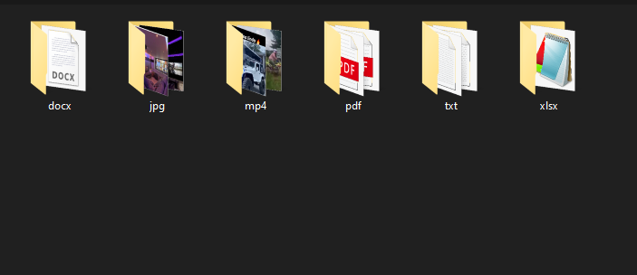

# FolderOrganizer  
 
  

> Code to organize folders by file type, Code working only via terminal (for now...) 

### Adjustments and improvements  

The project is still under development and future updates will focus on the following tasks:  

- [x] Back end code ready  
- [ ] Front end Etructure  
- [ ] Class Division  

Before starting, make sure you meet the following requirements:  
<!---Estes são apenas requisitos de exemplo. Adicionar, duplicar ou remover conforme necessário--->
* You have installed the latest version of Python `<linguagem / dependência / requeridos>`
* Do you have a Windows machine `<Windows / Linux / Mac>`.  
